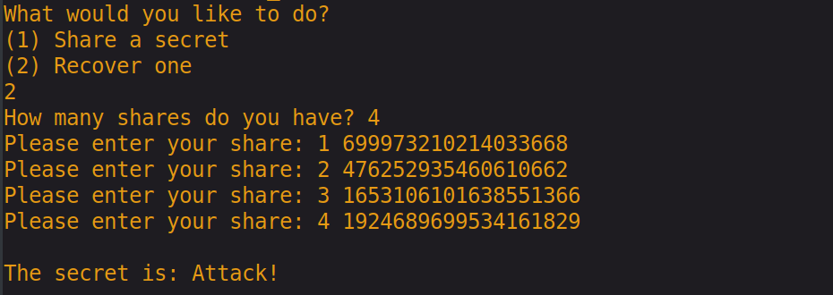
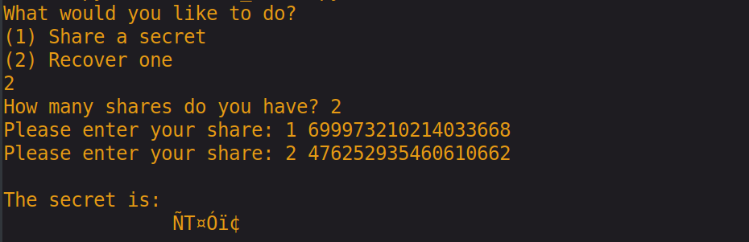

# secret-fracture
This is a small program for utilizing a Thresholded Secret Sharing Scheme (TSSS), allowing the user to fragment a message into n shares of information. A threshold will be specified as to how many of the n shares will be required for the program to reconstruct the secret.

With this we can reliably fragment sensitive data such as encryption keys, master passwords, and EFT card numbers.

Simply run the executable `secret_share.py` and select how many shares you would like your data split into, followed by the threshold share amount sufficient for recovering this secret. (e.g. a scheme in which we share some data between five parties such that any arbitrary combination of three of them can get together and recover the secret is referred to as an (n,k) thresholded scheme where n = 4 and k = 3).

Here we fragment a secret message: 'Attack!' into four distinct shares.

When we are ready to reconstruct the secret, simply re-run the program and input the sufficient number of shares, followed by the shares themselves. In the following example, we will use shares, 3, 4, and 1 to reconstruct the secret.

We now see that we can successfully reconstruct the secret from three of the given shares. We are able to reconstruct it even if our recovered messgage is overdetermined by providing more than k shares (e.g. below we recover the same secret using all of the shares provided. This demonstrates that our threshold, k, is a lower bound on the amount of shares needed to recover the message).

This scheme should achieve information-theoretic security. (i.e. given k-1 valid shares and unbounded computational resources, an adversary cannot uncover any information pertaining to the secret). Anyone attempting to recover the secret with a number of shares that is below the threshold will be unable to do so and the subsequent ciphertext that they receive will also give them no knowledge of the secret.

The use of this program, out of the box, requires Python-3.6+ in order to make use of the pseudo-random number generator used in the `secrets` module, which in turn uses the best pseudo-random generator provided by your operating system. Because of this, you can alternatively use `os.urandom` (on line 48 of `secret_share.py`) to generate what are hopefully cryptographically secure numbers. DO NOT use the `random` module provided by Python, it was not designed for cryptographic purposes. 

If you receive an `Error 101`, this implies that your message is too long to be encoded in a field that can be provided by the program. Feel free to add more prime powers to the mersenne list on line 34 of `secret_share.py` in order to encode larger messages; a list of these powers can be found at a link below. 

I intend to extend this project's capabilities to work in a smaller field and subsequently work more efficiently and on larger inputs, allowing the use of practical image sharing. I will also add future descriptions of what exactly is taking place in the share() and recover() algorithms, in order to clarify how information is handled in this protocol.

[How to Share a Secret - Adi Shamir](/docs/howtoshareasecret.pdf)

[Wikipedia - Shamir's Secret Sharing](https://en.wikipedia.org/wiki/Shamir%27s_Secret_Sharing)

[List of Mersenne Primes](https://www.mersenne.org/primes/)
