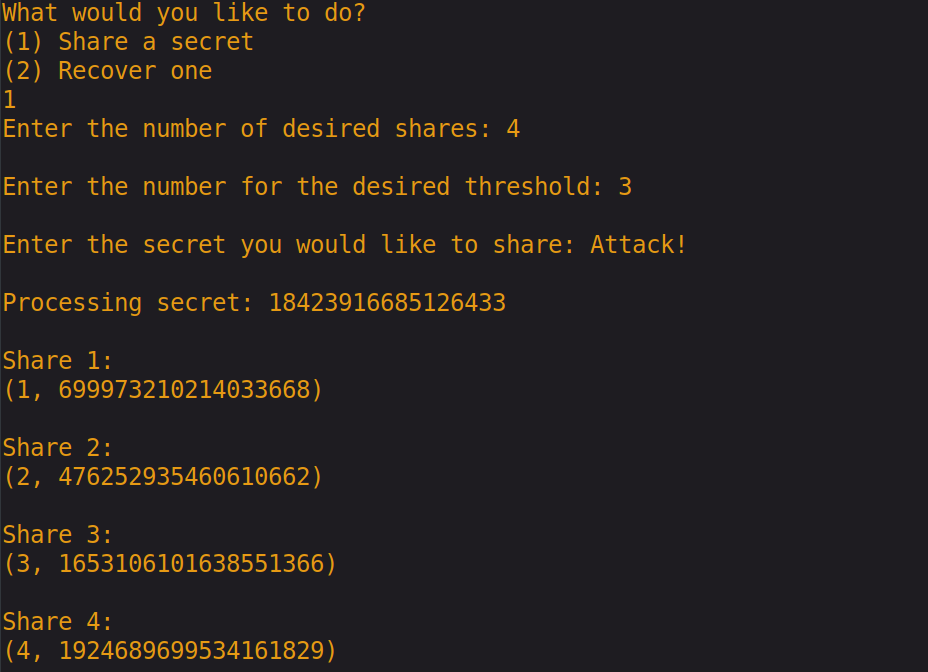
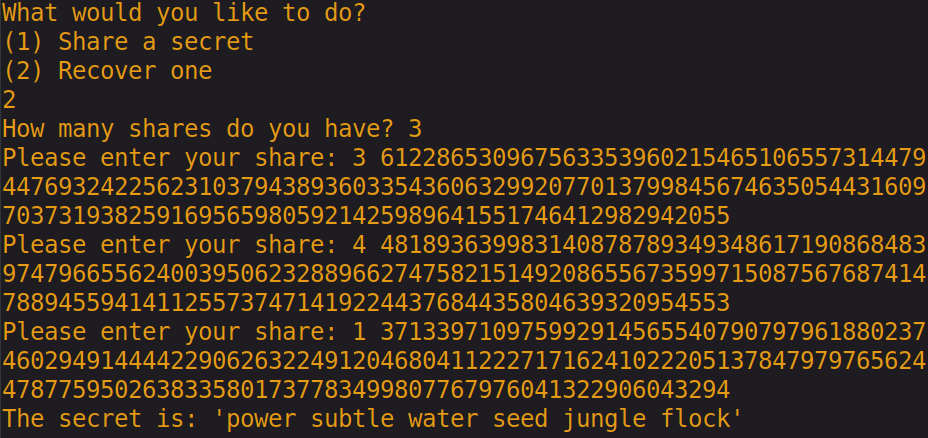

# secret-fracture
This is a small program for utilizing a Thresholded Secret Sharing Scheme (TSSS), allowing the user to fragment information such as plaintext into n shares of information. A threshold will be specified as to how many of the n shares will be required for the program to reconstruct the secret.

With this we can reliably fragment sensitive data such as encryption keys, master passwords, and EFT card numbers.

To see it in action, simply run the executable `secret_share.py` and select how many shares you would like your data split into, followed by the threshold share amount sufficient for recovering this secret. (e.g. a scheme in which we share some data between five parties such that any arbitrary combination of three of them can get together and recover the secret is referred to as an (n,k) thresholded scheme where n = 5 and k = 3).

Here we fragment a secret message: 'power subtle water seed jungle flock' into five distinct shares.

When we are ready to reconstruct the secret, simply re-run the program and input the sufficient number of shares, followed by the shares themselves. In the following example, we will use shares, 3, 4, and 1 to reconstruct the secret.

We now see that we can successfully reconstruct the secret from three of the given shares.

This scheme should achieve information-theoretic security. (i.e. given k-1 valid shares and unbounded computational resources, an adversary cannot uncover any information pertaining to the secret).
